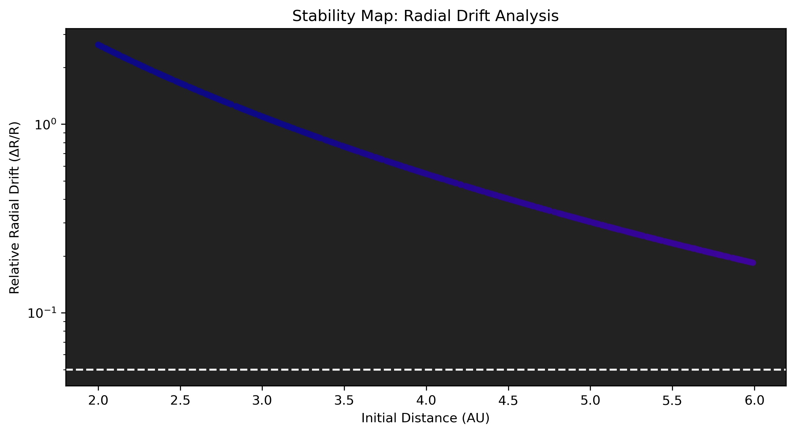
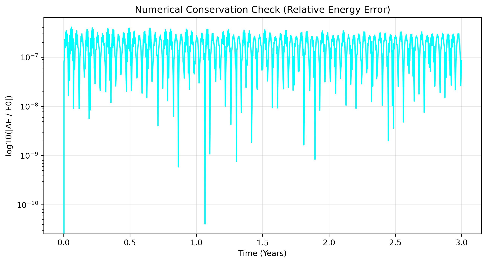
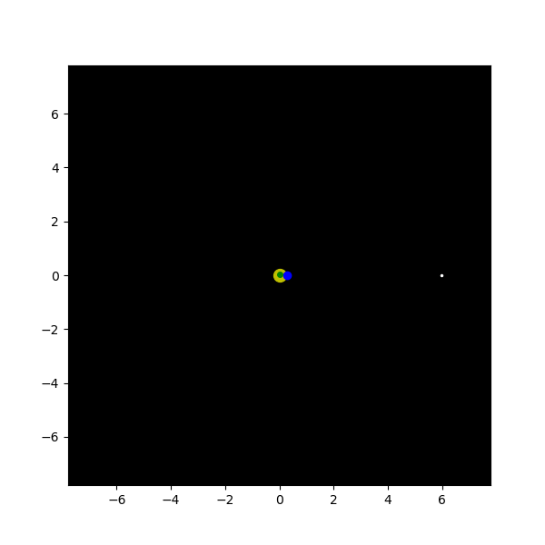

# Kepler-1047 Orbital Stability Analysis

## Project Overview
This project is a numerical investigation into the dynamical stability of the Kepler-1047 planetary system. The objective was to determine if stable asteroid orbits could exist within the circumplanetary environment given the gravitational influence of the two massive inner gas giants.

The analysis utilizes a custom N-body integrator to run a Monte Carlo simulation across a parameter space ranging from 0.1 to 9.0 AU. The results indicate that the system is dynamically hostile; the inner planets act as gravitational sweepers, destabilizing minor bodies through secular perturbations even at significant distances.

## Technical Implementation

### Vectorized Physics Engine
The gravitational acceleration logic is implemented using vectorized NumPy broadcasting. By calculating all O(N²) interactions through linear algebra rather than iterative loops, the simulation efficiently handles the high-throughput requirements of a 10,000-sample Monte Carlo run.

### Integration and Precision
Trajectories are integrated using an adaptive RK45 (Runge-Kutta) method. To ensure results represent physical reality rather than numerical artifacts, the solver was configured with tight tolerances (rtol=1e-10, atol=1e-12). Hamiltonian conservation was monitored throughout, maintaining a relative energy error of approximately 1e-7.

### Validation: The Null-Planet Test
A key part of the workflow involved distinguishing between numerical integration drift and physical dynamical chaos. A control simulation (Null-Planet Test) was conducted by setting the masses of Planets B and C to zero. The resulting drift was negligible (<1e-8), confirming that the 10% radial drift observed in the main simulation is a consequence of planetary perturbations and not a failure of the integrator.

## Data Visualization

### Stability Mapping

### Numerical Validation

### Orbital Trajectories

---

Author: Finn Ditum

